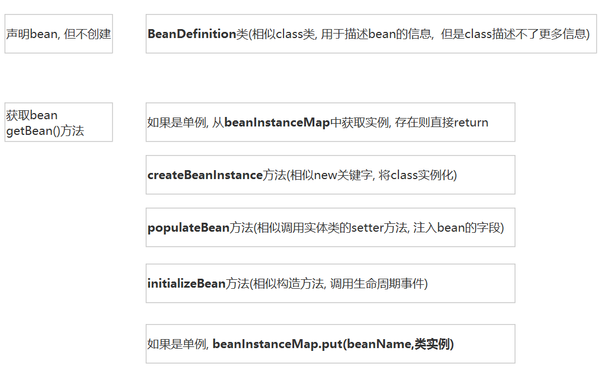
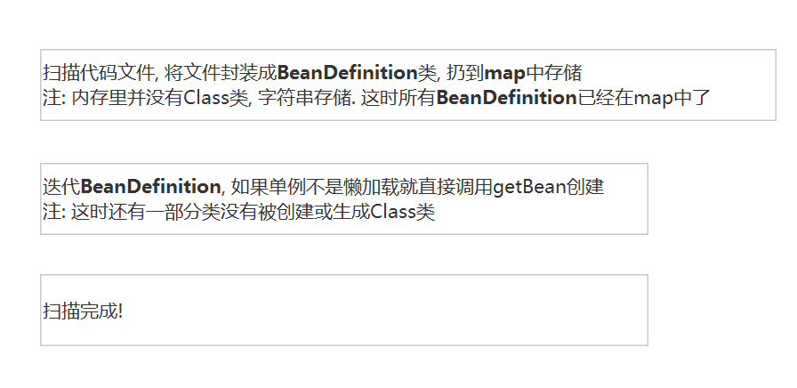

### 这是简化版spring容器的示例项目, 演示了这个小型容器的基本功能.(其实它已经基本完全实现了spring的容器骨架), 你可以通过它去学习spring的容器相关

* 特色 : 这个容器只有一个类{@link com.example.beanfactory.util.ApplicationX), 只依赖jdk.

* 查看具体实现 com.example.beanfactory.util.ApplicationX

* 查看测试用例 com.example.beanfactory.BeanfactoryApplication.main()

* 这个文件{@link com.example.beanfactory.util.ApplicationX}是从 [https://github.com/wangzihaogithub/spring-boot-protocol](https://github.com/wangzihaogithub/spring-boot-protocol) 项目中单拉出来的.

 ---
 
### 概述

* bean声明与创建

 
 
* bean扫描过程

 

 --- 
 
### spring介绍

 - **spring循环依赖的处理**

        循环依赖指 : bean在创建时, 因自动注入字段而触发的子bean又依赖正在创建的父bean. 
        这时父bean还没创建完, 找不到父bean就会报错.
        
        解决方式 : 把正在创建的bean放到一个临时的map中, 这样子bean就能获取到了, 就解决了.
 
 
  ---
  
作者邮箱 : 842156727@qq.com

github地址 : [https://github.com/wangzihaogithub/beanfactory-example](https://github.com/wangzihaogithub/beanfactory-example)

